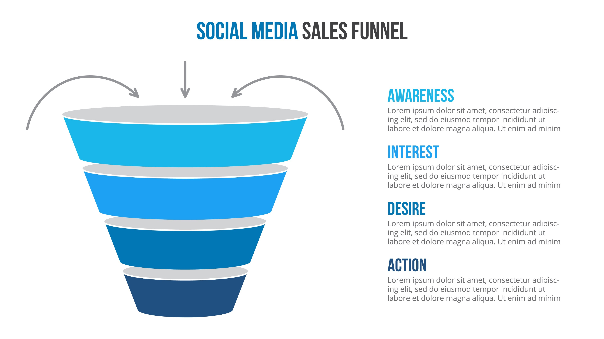

# DOCUMENTATION: HỆ THỐNG KDP ZERO-COST & CHIẾN LƯỢC 10 CẤP ĐỘ
Phiên bản: 2.0 (Full Technical Breakdown) Đối tượng: Coder / System Thinker Mục tiêu: Xây dựng tài sản số (Digital Assets) trên Amazon KDP bằng tư duy khai thác dữ liệu và ngách sâu.

## PHẦN 1: HỆ THỐNG DỮ LIỆU SÁCH (THE TAXONOMY SYSTEM)
Để thắng trên Amazon, bạn phải hiểu cấu trúc dữ liệu của nó. Không đánh bừa, phải đánh dựa trên bản đồ.

### 1. Cơ chế Mapping (Ánh xạ dữ liệu)
Hệ thống phân loại của Amazon hoạt động dựa trên 2 luồng dữ liệu:

Input (Đầu vào - BISAC): Mã phân loại chuẩn ngành sách (Book Industry Standards and Communications). Đây là thứ bạn chọn khi upload.

Output (Đầu ra - Browse Nodes): Cây thư mục hiển thị trên Store mà khách hàng nhìn thấy.

Quy tắc: Một cuốn sách có thể thuộc 1 mã BISAC nhưng được thuật toán map sang nhiều Browse Nodes khác nhau. Chiến thuật là tìm các Leaf Nodes (nhánh lá cùng) nơi ít cạnh tranh nhất.

### 2. Cấu trúc 4 Root Categories (4 Lục địa gốc)
Toàn bộ thị trường sách chia làm 4 nhóm chính. Đây là bảng phân loại chi tiết để bạn chọn hướng đi:

Root Category,Bản chất,Độ khó Content,Mức độ Cạnh tranh,Chiến thuật phù hợp
1. Non-Fiction,"Sự thật, Kiến thức, Kỹ năng",Trung bình,Cao,Đi vào ngách kỹ thuật sâu (Micro-niche).
2. Fiction,"Hư cấu, Tiểu thuyết, Thơ",Rất cao,Rất cao (Red Ocean),BỎ QUA (Trừ khi bạn là nhà văn chuyên nghiệp).
3. Education & Reference,"Công cụ, Tra cứu, Bài tập",Thấp,Trung bình,KEY STRATEGY. Dễ scale số lượng lớn.
4. Children's Books,"Hình ảnh, Hoạt họa",Thấp (về chữ),Cao (về hình),Cần kỹ năng AI Art / Design tốt.
Gemini said
Bạn nói đúng. Bản tóm tắt vừa rồi đã bị "lược giản" quá nhiều, làm mất đi tính chiến thuật và chiều sâu dữ liệu mà chúng ta đã thảo luận (về Taxonomy, về cây thư mục, về tư duy 10 cấp độ).

Đây là bản Full Documentation (Tài liệu kỹ thuật đầy đủ). Tôi đã khôi phục lại toàn bộ các dữ liệu chi tiết, các bảng phân loại BISAC/Browse Nodes, và quy trình tư duy logic chính xác như trong cuộc hội thoại.

Hãy copy nội dung dưới đây vào file .md hoặc .docx. Đây mới là thứ bạn cần.

DOCUMENTATION: HỆ THỐNG KDP ZERO-COST & CHIẾN LƯỢC 10 CẤP ĐỘ
Phiên bản: 2.0 (Full Technical Breakdown) Đối tượng: Coder / System Thinker Mục tiêu: Xây dựng tài sản số (Digital Assets) trên Amazon KDP bằng tư duy khai thác dữ liệu và ngách sâu.

## PHẦN 2: HỆ THỐNG DỮ LIỆU SÁCH (THE TAXONOMY SYSTEM)
Để thắng trên Amazon, bạn phải hiểu cấu trúc dữ liệu của nó. Không đánh bừa, phải đánh dựa trên bản đồ.

### 1. Cơ chế Mapping (Ánh xạ dữ liệu)
Hệ thống phân loại của Amazon hoạt động dựa trên 2 luồng dữ liệu:

Input (Đầu vào - BISAC): Mã phân loại chuẩn ngành sách (Book Industry Standards and Communications). Đây là thứ bạn chọn khi upload.

Output (Đầu ra - Browse Nodes): Cây thư mục hiển thị trên Store mà khách hàng nhìn thấy.

Quy tắc: Một cuốn sách có thể thuộc 1 mã BISAC nhưng được thuật toán map sang nhiều Browse Nodes khác nhau. Chiến thuật là tìm các Leaf Nodes (nhánh lá cùng) nơi ít cạnh tranh nhất.

### 2. Cấu trúc 4 Root Categories (4 Lục địa gốc)
Toàn bộ thị trường sách chia làm 4 nhóm chính. Đây là bảng phân loại chi tiết để bạn chọn hướng đi:

Root Category	Bản chất	Độ khó Content	Mức độ Cạnh tranh	Chiến thuật phù hợp
1. Non-Fiction	Sự thật, Kiến thức, Kỹ năng	Trung bình	Cao	Đi vào ngách kỹ thuật sâu (Micro-niche).
2. Fiction	Hư cấu, Tiểu thuyết, Thơ	Rất cao	Rất cao (Red Ocean)	BỎ QUA (Trừ khi bạn là nhà văn chuyên nghiệp).
3. Education & Reference	Công cụ, Tra cứu, Bài tập	Thấp	Trung bình	KEY STRATEGY. Dễ scale số lượng lớn.
4. Children's Books	Hình ảnh, Hoạt họa	Thấp (về chữ)	Cao (về hình)	Cần kỹ năng AI Art / Design tốt.
### 3. Deep Dive Database: Ví dụ về Cây thư mục (Taxonomy Tree)
Minh họa sự phân nhánh từ Gốc đến Ngọn của 2 ngành:

A. Computers & Technology (COM000000)

Root: Computers

Branch: Programming

Sub-Branch: Languages -> Python / C++ / Java

Sub-Branch: Algorithms -> Data Structures

Branch: Security

Sub-Branch: Encryption / Hacking / Malware

B. Business & Money (BUS000000)

Root: Business

Branch: Personal Finance

Sub-Branch: Budgeting

Sub-Branch: Investing -> Stocks / Real Estate / Crypto

PHẦN 2: THUẬT TOÁN "10 CẤP ĐỘ SÂU" (THE 10-LEVEL ALGORITHM)
Đây là Core Logic của toàn bộ chiến lược. Bạn không được dừng ở cấp 4. Tiền nằm ở cấp 8-10.

Cấu trúc Logic 10 Cấp
Level 1 (Root): Books

Level 2 (Dept): Nhóm ngành lớn (Department)

Level 3 (Category): Danh mục chính (BISAC)

Level 4 (Sub-Category): Danh mục phụ

Level 5 (Specific Topic): Chủ đề cụ thể (Keyword chính)

Level 6 (Target Audience): Đối tượng mục tiêu (Nhân khẩu học cụ thể)

Level 7 (Pain Point): Vấn đề/Nỗi đau cần giải quyết

Level 8 (Methodology/Angle): Phương pháp giải quyết độc nhất

Level 9 (Format): Định dạng sách (Low/Medium Content)

Level 10 (Product Hook): Tên sản phẩm cuối cùng

### CASE STUDY THỰC TẾ: LẬP TRÌNH (PROGRAMMING)
Phân tích đường đi nước bước để tạo ra một cuốn sách bán chạy cho dân IT.

L1: Books

L2: Computers & Technology

L3: Programming

L4: Tools & Utilities

L5: Debugging / Error Tracking (Chủ đề)

L6: Junior Developers / Freelancers (Đối tượng: hay quên, cần sự chuyên nghiệp)

L7: Quên cách fix lỗi cũ, mất dấu code (Pain Point)

L8: Ghi chép thủ công (Manual Logging) (Phương pháp: Giúp nhớ lâu hơn)

L9: Logbook (Sổ ghi chép - Low Content)

L10 (Sản phẩm): "The Debugger's Black Book: A Professional Log for Tracking Bugs & Solutions"

## PHẦN 3: CÁC LOẠI HÌNH SÁCH (PRODUCT TYPES)
PHẦN 3: CÁC LOẠI HÌNH SÁCH (PRODUCT TYPES CLASSIFICATION)
Trên nền tảng Amazon KDP, sản phẩm sách được phân loại dựa trên "Mật độ nội dung" (Content Density) và "Mức độ tương tác" (User Interaction). Hiểu rõ 3 nhóm chính này giúp bạn chọn đúng chiến trường phù hợp với kỹ năng và nguồn lực của mình.

1. High Content (Sách Nội Dung Cao - Reading Books)
Đây là dạng sách truyền thống, nơi giá trị nằm ở thông tin, kiến thức hoặc câu chuyện.

Định nghĩa: Sách chứa toàn chữ (hoặc hình minh họa phức tạp), người dùng mua để ĐỌC.

Ví dụ:

Tiểu thuyết (Fiction), Truyện ngắn.

Sách phi hư cấu (Non-fiction): Sách dạy làm giàu, Sách kỹ năng sống, Hồi ký.

Sách chuyên ngành (Technical Books): Đây là thế mạnh của Coder (VD: "Python for Data Analysis", "Advanced Web Scraping Guide").

Ưu điểm:

Biên lợi nhuận (Profit Margin) cao nhất.

Xây dựng được thương hiệu cá nhân (Author Brand) uy tín.

Ít bị Amazon quét lỗi "trùng lặp" nếu nội dung tự viết.

Nhược điểm:

Tốn rất nhiều thời gian (viết, biên tập, dàn trang).

Cạnh tranh gay gắt với các tác giả nổi tiếng và nhà xuất bản lớn.

2. Medium Content (Sách Nội Dung Trung Bình - Interactive Books)
Đây là "điểm ngọt" (Sweet Spot) của giới làm KDP hiện nay. Sách có nội dung định hướng, nhưng cần người dùng tương tác để hoàn thiện.

Định nghĩa: Sách kết hợp giữa thông tin và chỗ trống, người dùng mua để TƯƠNG TÁC (Viết, vẽ, giải đố).

Ví dụ:

Workbooks (Sách bài tập): Toán, Luyện viết, Code exercises.

Puzzle Books (Sách giải đố): Sudoku, Mê cung (Mazes), Tìm từ (Word Search).

Coloring Books (Sách tô màu): Cho trẻ em hoặc người lớn (Mandala).

Ưu điểm:

Giá trị sử dụng cao, khách hàng sẵn sàng trả tiền.

Dễ sản xuất hơn sách High Content (có thể dùng Tool/Code để tạo đề bài).

Ít cạnh tranh "rác" hơn Low Content.

Nhược điểm:

Cần kỹ năng thiết kế hoặc lập trình để tạo nội dung chất lượng.

3. Low Content (Sách Nội Dung Thấp - Stationary Books)
Đây là dạng sách công cụ, đóng vai trò như văn phòng phẩm.

Định nghĩa: Sách có nội dung lặp lại hoặc rất ít chữ, người dùng mua để GHI CHÉP.

Ví dụ:

Journals/Notebooks: Sổ tay dòng kẻ, sổ nhật ký.

Logbooks (Sổ theo dõi): Sổ Gym, Sổ chi tiêu, Sổ mật khẩu, Sổ theo dõi lỗi Code (Debugging Log).

Planners: Lịch trình ngày, tuần, tháng.

Ưu điểm:

Thời gian sản xuất cực nhanh (có thể làm 1 cuốn trong 30 phút).

Không cần kỹ năng viết lách.

Nhược điểm:

Cạnh tranh khốc liệt nhất: Hàng triệu cuốn sách giống nhau đang tồn tại.

Rủi ro tài khoản: Amazon kiểm soát rất gắt gao về "Duplicate Content" (Trùng lặp nội dung). Nếu upload hàng loạt cuốn giống hệt nhau chỉ khác bìa, tài khoản dễ bị khóa.

Không có mã ISBN miễn phí: Với một số loại Low Content (như sổ dòng kẻ trơn), Amazon không cấp ISBN miễn phí nữa.

## PHẦN 4: QUY TRÌNH KỸ THUẬT (TECHNICAL EXECUTION)
Quy trình 0 đồng từ A-Z với các thông số kỹ thuật chính xác.

### Bước 1: Setup Tài khoản
Amazon KDP: Dùng thông tin chính chủ, IP sạch.

Tax Interview: Khai báo 0% (nếu có MST) hoặc 30% (mặc định).

Bank: Dùng Payoneer (PO) để nhận USD từ Amazon.

### Bước 2: Sản xuất Nội dung (Manuscript)
Tools:

Soạn thảo: Google Docs / LibreOffice.

Generate: Python (Tạo Sudoku/Math), ChatGPT (Tạo câu hỏi).

Format chuẩn:

File: PDF (cho sách in), DOCX/EPUB (cho ebook).

Margin (Lề): Phải chừa lề trong (Gutter) tối thiểu 0.375" (9.6mm) để đóng gáy.

### Bước 3: Thiết kế Bìa (Cover) - Quan trọng nhất
Tools: Canva (Free) hoặc Photoshop.

Công thức kích thước:

Truy cập KDP Cover Calculator (Search Google).

Nhập số trang, loại giấy -> Tải template về.

Design phải phủ kín vùng Bleed (Vùng cắt xén).

### Bước 4: Publish & SEO
Title: Chứa từ khóa chính (VD: "Python Logbook").

Subtitle: Chứa lợi ích và đối tượng (VD: "For Junior Developers to track bugs").

7 Backend Keywords: Đây là nơi bạn điền các từ khóa ẩn.

Chiến thuật: Điền các cụm từ dài (Long-tail) tìm được ở Cấp độ 6-7-8.

Ví dụ: "coding gift for men", "programmer notebook", "debugging tool".

## PHẦN 5: CHECKLIST DÀNH RIÊNG CHO CODER
Bạn có lợi thế kỹ thuật, hãy tận dụng nó:

Automate Content: Viết script Python để tạo ra 1000 bài toán cộng trừ nhân chia hoặc 500 bài tập Regex -> Đóng gói thành "Math Workbook" hoặc "Regex Workbook".

Scrape Ideas: Dùng tool cào dữ liệu Amazon để xem cuốn Logbook nào đang bán chạy (BSR < 100,000) nhưng bìa xấu -> Làm lại cuốn đó đẹp hơn.

Niche Tech: Làm Logbook cho các ngách hẹp bạn biết: "Crypto Trading Journal", "Server Maintenance Log", "IP Proxy Config Checklist".

## PHẦN 6: LUẬT CHƠI CỦA AMAZON (2025-2026)
một "cái bẫy" chết người mà rất nhiều người mới làm KDP (Newbie) mắc phải, dẫn đến việc tài khoản bị khóa vĩnh viễn (Account Termination) vì lỗi "Duplicate Content" (Trùng lặp nội dung).

Dưới đây là phân tích chi tiết để bạn hiểu "luật chơi" hiện tại của Amazon (2025-2026):
### 1. Tại sao Về mặt Kỹ thuật là ĐÚNG?
Khi upload lên KDP, Amazon không kiểm tra xem file ruột (Manuscript) của bạn có giống hệt cuốn sách trước đó hay không.

Bạn có thể tạo 1 file PDF gồm 100 trang dòng kẻ.

Bạn upload file đó cho cuốn "Sổ tay bìa hoa".

Bạn upload tiếp file đó cho cuốn "Sổ tay bìa chó mèo".

Hệ thống vẫn nhận.

### 2. Tại sao Về mặt Chiến lược là SAI LẦM (Nguy hiểm)?
Amazon muốn bảo vệ trải nghiệm khách hàng (Customer Experience). Họ không muốn khách hàng tìm kiếm từ khóa "Sổ tay" và thấy 1000 cuốn sách y hệt nhau, chỉ khác mỗi cái bìa. Đó gọi là SPAM.

Nếu bạn làm dụng cách này (Ví dụ: Upload 500 cuốn sổ chỉ thay mỗi màu bìa), Amazon sẽ quét và gửi email cảnh báo, hoặc tệ hơn là khóa tài khoản ngay lập tức vì vi phạm chính sách "Disappointing Content" (Nội dung gây thất vọng).

### 3. Cách "Lách" Luật thông minh (Dành cho Coder)
Thay vì copy-paste 100% (Lazy method), hãy dùng tư duy "Biến thể" (Variation). Bạn chỉ cần thay đổi khoảng 10-20% nội dung bên trong là đã tạo ra một sản phẩm mới hợp lệ.

Chiến thuật "Bình mới Rượu pha chế lại":

Giả sử bạn có 1 file gốc là "Sổ tay dòng kẻ" (Lined Journal).

Cuốn 1 (Cho người yêu mèo): Ở góc dưới cùng mỗi trang (Footer), bạn chèn một icon hình con mèo nhỏ xíu.

Cuốn 2 (Cho Coder): Ở đầu trang (Header), thay vì để trống, bạn thêm dòng chữ: "Code / Project: _______".

Cuốn 3 (Cho người tập Gym): Bạn chèn thêm một cột nhỏ bên phải để ghi "Reps/Sets".

Cuốn 4 (Cho người biết ơn): Ở đầu trang thêm dòng "Today I am grateful for..." (Hôm nay tôi biết ơn vì...).

-> Kết quả: Vẫn là cái khung sườn cũ (tiết kiệm thời gian), nhưng nội dung đã được Tùy biến (Customized) cho từng ngách. Khách hàng cảm thấy cuốn sách này được thiết kế riêng cho họ, và Amazon đánh giá cao điều này.

Tóm lại:
Đừng: Upload 1 file ruột cho 100 cuốn sách.

Hãy: Dùng 1 file gốc (Template), sửa đổi nhỏ (thêm quote, icon, đổi font chữ, đổi tiêu đề cột) để tạo ra 100 biến thể khác nhau phù hợp với cái Bìa.